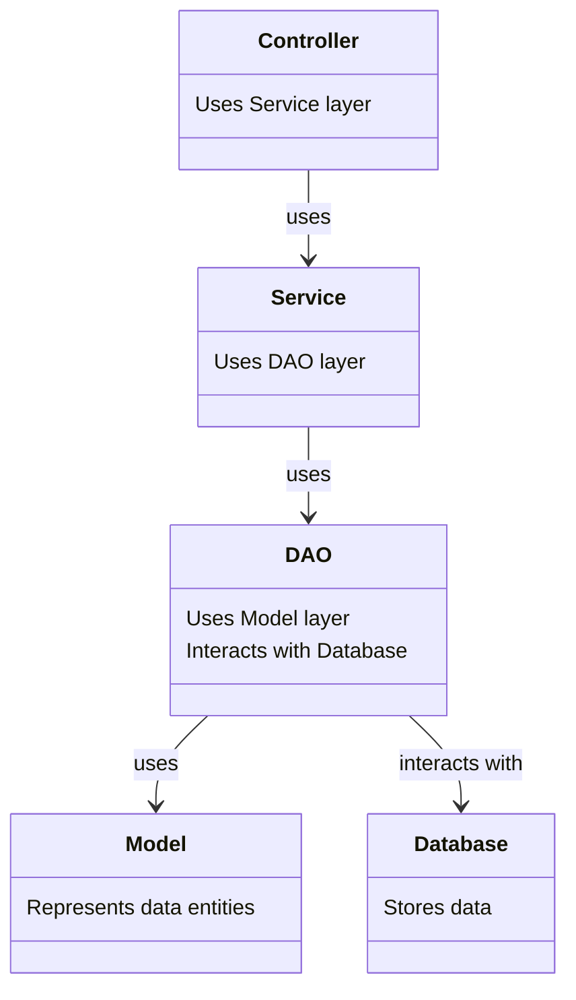

# Class Diagram for Doctor Appointment System

## Model Layer

```mermaid
classDiagram
    class User {
        -int id
        -String username
        -String email
        -String password
        -String phone
        -String role
        -String firstName
        -String lastName
        -String dateOfBirth
        -String gender
        -String address
        +getId() int
        +setId(int id) void
        +getUsername() String
        +setUsername(String username) void
        +getEmail() String
        +setEmail(String email) void
        +getPassword() String
        +setPassword(String password) void
        +getPhone() String
        +setPhone(String phone) void
        +getRole() String
        +setRole(String role) void
        +getFirstName() String
        +setFirstName(String firstName) void
        +getLastName() String
        +setLastName(String lastName) void
        +getDateOfBirth() String
        +setDateOfBirth(String dateOfBirth) void
        +getGender() String
        +setGender(String gender) void
        +getAddress() String
        +setAddress(String address) void
        +getName() String
    }

    class Doctor {
        -int id
        -int userId
        -int departmentId
        -String name
        -String firstName
        -String lastName
        -String specialization
        -String qualification
        -String experience
        -String email
        -String phone
        -String address
        -String consultationFee
        -String availableDays
        -String availableTime
        -String imageUrl
        -String profileImage
        -String bio
        -double rating
        -int patientCount
        -int successRate
        -String status
        +getId() int
        +setId(int id) void
        +getUserId() int
        +setUserId(int userId) void
        +getDepartmentId() int
        +setDepartmentId(int departmentId) void
        +getName() String
        +setName(String name) void
        +getFirstName() String
        +setFirstName(String firstName) void
        +getLastName() String
        +setLastName(String lastName) void
        +getSpecialization() String
        +setSpecialization(String specialization) void
        +getQualification() String
        +setQualification(String qualification) void
        +getExperience() String
        +setExperience(String experience) void
        +getEmail() String
        +setEmail(String email) void
        +getPhone() String
        +setPhone(String phone) void
        +getAddress() String
        +setAddress(String address) void
        +getConsultationFee() String
        +setConsultationFee(String consultationFee) void
        +getAvailableDays() String
        +setAvailableDays(String availableDays) void
        +getAvailableTime() String
        +setAvailableTime(String availableTime) void
        +getImageUrl() String
        +setImageUrl(String imageUrl) void
        +getProfileImage() String
        +setProfileImage(String profileImage) void
        +getBio() String
        +setBio(String bio) void
        +getRating() double
        +setRating(double rating) void
        +getPatientCount() int
        +setPatientCount(int patientCount) void
        +getSuccessRate() int
        +setSuccessRate(int successRate) void
        +getStatus() String
        +setStatus(String status) void
        +getFullName() String
    }

    class Patient {
        -int id
        -int userId
        -String firstName
        -String lastName
        -String dateOfBirth
        -String gender
        -String phone
        -String address
        -String bloodGroup
        -String allergies
        -String medicalHistory
        -String email
        -String lastVisit
        -String status
        +getId() int
        +setId(int id) void
        +getUserId() int
        +setUserId(int userId) void
        +getFirstName() String
        +setFirstName(String firstName) void
        +getLastName() String
        +setLastName(String lastName) void
        +getDateOfBirth() String
        +setDateOfBirth(String dateOfBirth) void
        +getGender() String
        +setGender(String gender) void
        +getPhone() String
        +setPhone(String phone) void
        +getAddress() String
        +setAddress(String address) void
        +getBloodGroup() String
        +setBloodGroup(String bloodGroup) void
        +getAllergies() String
        +setAllergies(String allergies) void
        +getMedicalHistory() String
        +setMedicalHistory(String medicalHistory) void
        +getEmail() String
        +setEmail(String email) void
        +getLastVisit() String
        +setLastVisit(String lastVisit) void
        +getStatus() String
        +setStatus(String status) void
        +getFullName() String
        +getAge() int
    }

    class Appointment {
        -int id
        -int patientId
        -int doctorId
        -String patientName
        -String doctorName
        -Date appointmentDate
        -String appointmentTime
        -String status
        -String symptoms
        -String prescription
        -String reason
        -String notes
        -double fee
        -String doctorSpecialization
        -String medicalReport
        +getId() int
        +setId(int id) void
        +getPatientId() int
        +setPatientId(int patientId) void
        +getDoctorId() int
        +setDoctorId(int doctorId) void
        +getPatientName() String
        +setPatientName(String patientName) void
        +getDoctorName() String
        +setDoctorName(String doctorName) void
        +getAppointmentDate() Date
        +setAppointmentDate(Date appointmentDate) void
        +getAppointmentTime() String
        +setAppointmentTime(String appointmentTime) void
        +getAppointmentLocalDate() LocalDate
        +getAppointmentLocalTime() LocalTime
        +getStatus() String
        +setStatus(String status) void
        +getSymptoms() String
        +setSymptoms(String symptoms) void
        +getPrescription() String
        +setPrescription(String prescription) void
        +getReason() String
        +setReason(String reason) void
        +getNotes() String
        +setNotes(String notes) void
        +getFee() double
        +setFee(double fee) void
        +getDoctorSpecialization() String
        +setDoctorSpecialization(String doctorSpecialization) void
        +getMedicalReport() String
        +setMedicalReport(String medicalReport) void
        +getFormattedDateTime() String
    }

    class Department {
        -int id
        -String name
        -String description
        -String status
        -String createdAt
        -String updatedAt
        +getId() int
        +setId(int id) void
        +getName() String
        +setName(String name) void
        +getDescription() String
        +setDescription(String description) void
        +getStatus() String
        +setStatus(String status) void
        +getCreatedAt() String
        +setCreatedAt(String createdAt) void
        +getUpdatedAt() String
        +setUpdatedAt(String updatedAt) void
    }

    class Specialty {
        -int id
        -String name
        -String description
        -String iconUrl
        +getId() int
        +setId(int id) void
        +getName() String
        +setName(String name) void
        +getDescription() String
        +setDescription(String description) void
        +getIconUrl() String
        +setIconUrl(String iconUrl) void
    }

    class DoctorRegistrationRequest {
        -int id
        -String username
        -String email
        -String password
        -String firstName
        -String lastName
        -String phone
        -String dateOfBirth
        -String gender
        -String address
        -String specialization
        -String qualification
        -String experience
        -String bio
        -String status
        -String adminNotes
        -Timestamp createdAt
        -Timestamp updatedAt
        +getId() int
        +setId(int id) void
        +getUsername() String
        +setUsername(String username) void
        +getEmail() String
        +setEmail(String email) void
        +getPassword() String
        +setPassword(String password) void
        +getFirstName() String
        +setFirstName(String firstName) void
        +getLastName() String
        +setLastName(String lastName) void
        +getPhone() String
        +setPhone(String phone) void
        +getDateOfBirth() String
        +setDateOfBirth(String dateOfBirth) void
        +getGender() String
        +setGender(String gender) void
        +getAddress() String
        +setAddress(String address) void
        +getSpecialization() String
        +setSpecialization(String specialization) void
        +getQualification() String
        +setQualification(String qualification) void
        +getExperience() String
        +setExperience(String experience) void
        +getBio() String
        +setBio(String bio) void
        +getStatus() String
        +setStatus(String status) void
        +getAdminNotes() String
        +setAdminNotes(String adminNotes) void
        +getCreatedAt() Timestamp
        +setCreatedAt(Timestamp createdAt) void
        +getUpdatedAt() Timestamp
        +setUpdatedAt(Timestamp updatedAt) void
    }

    User <|-- Doctor : associated with
    User <|-- Patient : associated with
    Doctor --> Department : belongs to
    Doctor --> Specialty : has
    Patient --> Appointment : makes
    Doctor --> Appointment : receives
    DoctorRegistrationRequest --> Doctor : creates
```

## DAO Layer

```mermaid
classDiagram
    class UserDAO {
        +emailExists(String email) boolean
        +registerUser(User user) boolean
        +login(String email, String password) User
        +getUserByEmail(String email) User
        +getUserById(int id) User
        +getAllUsers() List~User~
        +updateUser(User user) boolean
        +savePatientDetails(int userId, String dateOfBirth, String gender, String address, String bloodGroup, String allergies) boolean
        +saveDoctorDetails(int userId, String specialization, String qualification, String experience, String address, String bio) boolean
        +deleteUser(int id) boolean
    }

    class DoctorDAO {
        +addDoctor(Doctor doctor) boolean
        +getDoctorById(int id) Doctor
        +getAllDoctors() List~Doctor~
        +getApprovedDoctors() List~Doctor~
        +searchDoctors(String searchTerm) List~Doctor~
        +searchApprovedDoctors(String searchTerm) List~Doctor~
        +getDoctorsBySpecialization(String specialization) List~Doctor~
        +getApprovedDoctorsBySpecialization(String specialization) List~Doctor~
        +updateDoctor(Doctor doctor) boolean
        +deleteDoctor(int id) boolean
        +getTotalDoctors() int
        +getApprovedDoctorsCount() int
        +getRecentDoctors(int limit) List~Doctor~
    }

    class PatientDAO {
        +addPatient(Patient patient) boolean
        +getPatientById(int id) Patient
        +getPatientByUserId(int userId) Patient
        +getAllPatients() List~Patient~
        +searchPatients(String searchTerm) List~Patient~
        +updatePatient(Patient patient) boolean
        +deletePatient(int id) boolean
        +getTotalPatients() int
        +getRecentPatients(int limit) List~Patient~
        +getRecentMedicalRecords(int patientId, int limit) List~MedicalRecord~
    }

    class AppointmentDAO {
        +bookAppointment(Appointment appointment) boolean
        +getAppointmentById(int id) Appointment
        +getAppointmentsByPatientId(int patientId) List~Appointment~
        +getAppointmentsByDoctorId(int doctorId) List~Appointment~
        +updateAppointment(Appointment appointment) boolean
        +updateAppointmentStatus(int id, String status) boolean
        +updateAppointmentStatusWithReason(int id, String status, String reason) boolean
        +deleteAppointment(int id) boolean
        +getRecentAppointments(int limit) List~Appointment~
        +getTodayAppointmentsByDoctor(int doctorId) List~Appointment~
        +getUpcomingAppointmentsByDoctor(int doctorId) List~Appointment~
        +getPendingAppointmentsByDoctor(int doctorId) List~Appointment~
        +getCompletedAppointmentsByDoctor(int doctorId) List~Appointment~
        +getUpcomingAppointmentsByPatient(int patientId) List~Appointment~
        +getUpcomingAppointmentCountByPatient(int patientId) int
        +getTotalAppointments() int
        +getTotalRevenue() double
    }

    class DepartmentDAO {
        +getAllDepartments() List~Department~
        +getDepartmentById(int id) Department
        +addDepartment(Department department) boolean
        +updateDepartment(Department department) boolean
        +deleteDepartment(int id) boolean
        +getTotalDepartments() int
    }

    class SpecialtyDAO {
        +addSpecialty(Specialty specialty) boolean
        +getSpecialtyById(int id) Specialty
        +getAllSpecialties() List~Specialty~
        +updateSpecialty(Specialty specialty) boolean
        +deleteSpecialty(int id) boolean
    }

    class DoctorRegistrationRequestDAO {
        +createRequest(DoctorRegistrationRequest request) boolean
        +getRequestById(int id) DoctorRegistrationRequest
        +getAllRequests() List~DoctorRegistrationRequest~
        +updateRequest(DoctorRegistrationRequest request) boolean
        +deleteRequest(int id) boolean
        +approveRequest(int id, String adminNotes) boolean
        +rejectRequest(int id, String adminNotes) boolean
    }

    UserDAO --> User : manages
    DoctorDAO --> Doctor : manages
    PatientDAO --> Patient : manages
    AppointmentDAO --> Appointment : manages
    DepartmentDAO --> Department : manages
    SpecialtyDAO --> Specialty : manages
    DoctorRegistrationRequestDAO --> DoctorRegistrationRequest : manages
```

## Service Layer

```mermaid
classDiagram
    class UserService {
        -UserDAO userDAO
        +UserService()
        +emailExists(String email) boolean
        +registerUser(User user) boolean
        +login(String email, String password) User
        +getUserByEmail(String email) User
        +getUserById(int id) User
        +getAllUsers() List~User~
        +updateUser(User user) boolean
        +savePatientDetails(int userId, String dateOfBirth, String gender, String address, String bloodGroup, String allergies) boolean
        +saveDoctorDetails(int userId, String specialization, String qualification, String experience, String address, String bio) boolean
        +deleteUser(int id) boolean
    }

    class DoctorService {
        -DoctorDAO doctorDAO
        +DoctorService()
        +addDoctor(Doctor doctor) boolean
        +getDoctorById(int id) Doctor
        +getAllDoctors() List~Doctor~
        +getApprovedDoctors() List~Doctor~
        +searchDoctors(String searchTerm) List~Doctor~
        +searchApprovedDoctors(String searchTerm) List~Doctor~
        +getDoctorsBySpecialization(String specialization) List~Doctor~
        +getApprovedDoctorsBySpecialization(String specialization) List~Doctor~
        +updateDoctor(Doctor doctor) boolean
        +deleteDoctor(int id) boolean
        +getTotalDoctors() int
        +getTotalApprovedDoctors() int
        +getRecentDoctors(int limit) List~Doctor~
    }

    class PatientService {
        -PatientDAO patientDAO
        +PatientService()
        +addPatient(Patient patient) boolean
        +getPatientById(int id) Patient
        +getPatientByUserId(int userId) Patient
        +getAllPatients() List~Patient~
        +searchPatients(String searchTerm) List~Patient~
        +updatePatient(Patient patient) boolean
        +deletePatient(int id) boolean
        +getTotalPatients() int
        +getRecentPatients(int limit) List~Patient~
        +getRecentMedicalRecords(int patientId, int limit) List~MedicalRecord~
    }

    class AppointmentService {
        -AppointmentDAO appointmentDAO
        +AppointmentService()
        +bookAppointment(Appointment appointment) boolean
        +getAppointmentById(int id) Appointment
        +getAppointmentsByPatientId(int patientId) List~Appointment~
        +getAppointmentsByDoctorId(int doctorId) List~Appointment~
        +updateAppointment(Appointment appointment) boolean
        +updateAppointmentStatus(int id, String status) boolean
        +updateAppointmentStatusWithReason(int id, String status, String reason) boolean
        +deleteAppointment(int id) boolean
        +getRecentAppointments(int limit) List~Appointment~
        +getTodayAppointmentsByDoctor(int doctorId) List~Appointment~
        +getUpcomingAppointmentsByDoctor(int doctorId) List~Appointment~
        +getPendingAppointmentsByDoctor(int doctorId) List~Appointment~
        +getCompletedAppointmentsByDoctor(int doctorId) List~Appointment~
        +getUpcomingAppointmentsByPatient(int patientId) List~Appointment~
        +getUpcomingAppointmentCountByPatient(int patientId) int
        +getTotalAppointments() int
        +getTotalRevenue() double
        +getAvailableTimeSlots(int doctorId) List~String~
        +isTimeSlotAvailable(int doctorId, String date, String time) boolean
    }

    class DepartmentService {
        -DepartmentDAO departmentDAO
        +DepartmentService()
        +getAllDepartments() List~Department~
        +getDepartmentById(int id) Department
        +addDepartment(Department department) boolean
        +updateDepartment(Department department) boolean
        +deleteDepartment(int id) boolean
        +getTotalDepartments() int
    }

    UserService --> UserDAO : uses
    DoctorService --> DoctorDAO : uses
    PatientService --> PatientDAO : uses
    AppointmentService --> AppointmentDAO : uses
    DepartmentService --> DepartmentDAO : uses
```

## Relationships Between Layers

```mermaid
classDiagram
    class Controller {
        Uses Service layer
    }
    
    class Service {
        Uses DAO layer
    }
    
    class DAO {
        Uses Model layer
        Interacts with Database
    }
    
    class Model {
        Represents data entities
    }
    
    class Database {
        Stores data
    }
    
    Controller --> Service : uses
    Service --> DAO : uses
    DAO --> Model : uses
    DAO --> Database : interacts with
```
